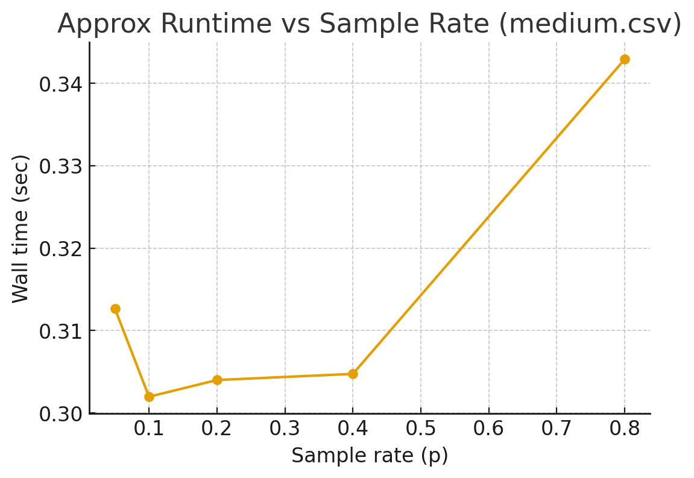
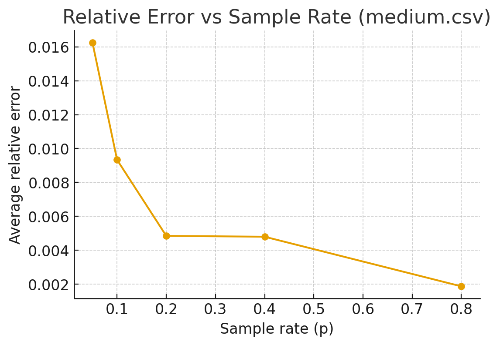

# AQP-Engine

**Approximate Query Processing Engine**

---

## 🧾 Table of Contents

- [Overview](#overview)  
- [Features](#features)  
- [Architecture](#architecture)  
- [Getting Started](#getting-started)  
  - [Requirements](#requirements)  
  - [Installation](#installation)  
- [Usage](#usage)  
  - [Web Interface](#web-interface)  
  - [Command-Line Interface (CLI)](#command-line-interface-cli)  
- [Benchmarking](#benchmarking)  
- [Trade-Offs](#trade-offs)  

---

## Overview

The AQP-Engine is a tool to run **approximate SQL-style queries** on large datasets, providing a controllable trade-off between speed and accuracy. Useful when exact precision isn’t strictly necessary but insights are needed quickly (e.g. analytics, dashboards, exploratory data).

---

## Features

- Support for **three query methods**:
  - `exact` — full scan, precise/accurate result  
  - `sample` — random sampling for quick approx results  
  - `stream` — reservoir sampling for streaming/online approximations  

- SQL-like syntax (SELECT, GROUP BY, aggregations etc.)  

- Web UI (via Streamlit) + CLI for flexible usage  

- Benchmarking tools to evaluate performance vs error under different methods and sample rates  

- Data loaders for CSV & Parquet formats  

---

## Architecture

| Component | Purpose |
|---|---|
| **Parser** (`parser.py`) | Parses SQL-style queries into an internal structured representation |
| **Sampling** (`sampling.py`) | Implements sampling methods: uniform sampling, reservoir sampling etc. |
| **Engine** (`engine.py`) | Core query execution: parse → plan → run using selected method (exact / sample / stream) |
| **Data Loader** (`data.py`) | Handles loading data from CSV / Parquet |
| **Benchmarking** (`benchmark.py`) | Tools for measuring execution time & error of methods under different settings |

---

## Getting Started

### Requirements

- Python 3.x (≥ 3.7 recommended)  
- Required Python packages listed in `requirements.txt`  
- (Optional) Streamlit for web front-end  

### Installation

```bash
# clone the repo
git clone https://github.com/sriujjwal01/AQP-Engine.git
cd AQP-Engine

# install dependencies
pip install -r requirements.txt
```

---

## Usage

### Web Interface

Launch the Streamlit app:

```bash
streamlit run aqp/ui_app.py
```

- Upload your dataset (CSV or Parquet)  
- Enter SQL-style queries  
- Choose approximation method (exact / sample / stream) & parameters (e.g. sample rate)  
- View results and comparisons  

### Command-Line Interface (CLI)

Example:

```bash
python -m aqp.cli   --query "SELECT city, SUM(amount) FROM your_data.csv GROUP BY city"   --method sample   --sample_rate 0.1
```

Options:

- `--query` : SQL-style query string  
- `--method` : `exact` | `sample` | `stream`  
- `--sample_rate` : fraction of data to sample (for `sample` method)  
- Other method-specific parameters  

---

## Benchmarking

Compare performance & accuracy:

```bash
python -m aqp.benchmark   --data your_data.csv   --query "SELECT city, SUM(amount) FROM your_data.csv GROUP BY city"
```

Outputs execution time, relative errors, and results across sample rates.

### Example Results

**Runtime vs Sample Rate**


**Relative Error vs Sample Rate**


---
---

## Trade-Offs

| Method | Speed | Accuracy | Use Case |
|---|---|---|---|
| **exact** | Slowest (full scan) | Highest / no error | When exact results required |
| **sample** | Faster than exact | Accuracy depends on sample size | Quick insights |
| **stream** | Works on streaming / huge data | Approximation error depends on reservoir size | Streaming data / memory-limited settings |

